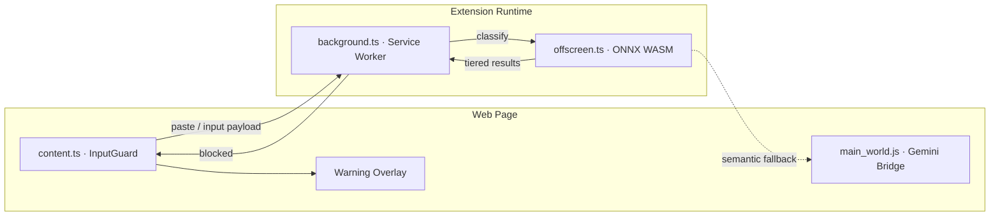

# SourceCloak

**The first client-side structural defense layer blocking proprietary code exposures before transmission.**

SourceCloak is an enterprise-grade Chrome extension that intercepts sensitive code, credentials, and corporate signatures in text inputs **before** they can reach external cloud tools. All classification runs on-device — blocked payloads never leave the browser.

<p align="center">
  
</p>

<p align="center">
  <a href="https://www.typescriptlang.org/"></a>
  <a href="https://developer.chrome.com/docs/extensions/mv3/"></a>
  <a href="https://vitejs.dev/"></a>
  <a href="https://vitest.dev/"></a>
</p>

<p align="center">
  
  
  
  
</p>

---

## Overview

Engineering teams face constant pressure to prevent proprietary codebase exposure into external systems — AI assistants, translation tools, ticketing platforms, and paste-heavy SaaS surfaces. SourceCloak adds an **air-gapped interception layer** directly in the browser:

1. Monitors textareas, inputs, and `contenteditable` fields across active tabs
2. Classifies pasted and typed payloads using a multi-tier on-device pipeline
3. Purges blocked input locally and displays a secure warning overlay
4. Logs intercept events to a local audit trail — no remote telemetry

---

## Key Features

| Capability | Description |
|------------|-------------|
| **Paste interception** | Capture-phase `paste` blocking before network transmission |
| **Advanced editor support** | Native safe-hooks for Monaco and CodeMirror (AI chat UIs) |
| **Input monitoring** | Throttled continuous scanning of typed content |
| **4-tier classifier** | Regex → token scoring → ONNX WASM (always on) → optional Gemini Nano enhancement |
| **Corporate signatures** | Custom regex and internal config markers per organization |
| **Domain policy** | Monitored and trusted domain lists for scoped enforcement |
| **Policy Console** | Enterprise options dashboard for sensitivity, patterns, and audit review |
| **Local audit log** | On-device intercept history with category-level stats |

---

## Architecture



### Classification pipeline

| Tier | Engine | Targets |
|------|--------|---------|
| 1 | Regex | SSH keys, AWS/GitHub/Stripe tokens, JWTs, `.env` secrets, DB URLs |
| 2 | Token scorer | Proprietary token density, internal API markers, code blocks |
| 3 | ONNX WASM | Structural heuristics via offscreen DistilBERT pipeline |
| 4 | Gemini Nano | Optional semantic enhancement via Chrome Prompt API (never required) |

Core protection uses Tier 1–3 on every modern Chrome install. Gemini Nano is cached-detected at install and updated via `ai_capability` storage — popup and Policy Console show green (enhanced), blue (optimized ONNX), or yellow (temporary fallback) status.

---

## Project Structure

```
sourcecloak/
├── background.ts          # Service worker, offscreen lifecycle, audit log
├── content.ts             # Input guard injection and policy sync
├── main_world.ts          # Gemini Nano bridge (main-world context)
├── offscreen.ts           # ONNX WASM classification runtime
├── src/
│   ├── manifest.json      # Source manifest (compiled by Vite)
│   ├── patterns.ts        # Secret and credential pattern library
│   ├── classifier.ts      # Rule-based classification orchestration
│   ├── input-guard.ts     # DOM listener and paste blocking
│   └── warning-overlay.ts # Enterprise block notification UI
├── popup/                 # Extension popup dashboard
├── options/               # Policy Console
├── tests/                 # Vitest unit tests
└── dist/                  # ← Load this folder in Chrome
```

---

## End-user install

Install from the **Chrome Web Store** (placeholder until the listing is live):

`https://chromewebstore.google.com/detail/sourcecloak/PLACEHOLDER_EXTENSION_ID`

SourceCloak is 100% free and open-source under the MIT license.

---

## Contributor development

### Prerequisites

- [Node.js](https://nodejs.org/) 18+ or Bun
- Google Chrome or Chromium 120+ (Manifest V3 + offscreen documents)
- Optional: Chrome built-in **Gemini Nano** for Tier 4 semantic review

### Install dependencies

```bash
cd sourcecloak
npm install
```

### Build

```bash
npm run build
```

The postbuild step validates that `dist/manifest.json` references compiled `.js` entrypoints and prints the load path.

### Load unpacked (dev only)

1. Open Chrome and navigate to `chrome://extensions`.
2. Enable **Developer mode** in the top right.
3. Click **Load unpacked** and select the `sourcecloak/dist` directory.

### Verify protection

Paste a test SSH key block into any textarea on a SaaS site. SourceCloak should:

- Purge the field immediately
- Show the **Transmission Blocked** overlay
- Record the event in the local audit log

See [TESTING.md](./TESTING.md) for the full test guide and sample payloads.

---

## Available Scripts

| Script               | Description                            |
| ----------------------| ----------------------------------------|
| `npm run dev`        | Build in watch mode                    |
| `npm run build`      | Production build + manifest validation |
| `npm run extension`  | Alias for `npm run build`              |
| `npm run test`       | Run Vitest unit tests                  |
| `npm run type-check` | TypeScript validation                  |
| `npm run verify`     | Type-check + tests                     |

---

## Configuration

Open the **Policy Console** from the extension options page or popup.

| Setting | Default | Purpose |
|---------|---------|---------|
| Protection | Enabled | Master on/off switch |
| Sensitivity | 65 | Block threshold (0 = strict, 100 = permissive) |
| ONNX classifier | Always on | Offscreen WASM structural analysis |
| Gemini Nano | Optional | Tier 4 enhancement when Prompt API is available |
| Monitored domains | All | Restrict scanning to specific hosts |
| Trusted domains | None | Bypass scanning for internal tools |
| Corporate signatures | Empty | Organization-specific config markers |

---

## Permissions

| Permission | Reason |
|------------|--------|
| `storage` | Policy settings and local audit log |
| `offscreen` | ONNX WASM classification runtime |
| `alarms` | Background lifecycle management |
| `<all_urls>` | Content script input monitoring on active tabs |

No remote servers receive scanned payload content. Hugging Face is contacted only for one-time ONNX model weight downloads when the WASM classifier is first initialized.

---

## Documentation

- [SECURITY.md](./SECURITY.md) — Vulnerability reporting and support policy
- [TESTING.md](./TESTING.md) — Manual and automated testing guide with sample payloads
- [PRIVACY.md](./PRIVACY.md) — Privacy policy and data handling

---

## License

SourceCloak is free and open-source software licensed under the MIT License. See [LICENSE](./LICENSE) for the full license text.

---

## B2B Positioning

SourceCloak is designed as a browser utility for engineering organizations that need structural, client-side leak prevention without routing employee traffic through a cloud proxy. Policy signatures, domain scope, and audit retention are fully configurable per deployment at no cost.